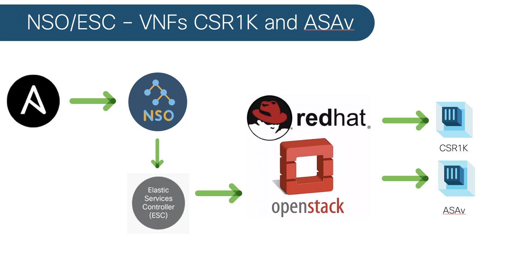

# Ansible NSO/ESC VNFs - CSR1kv and ASAv

An Ansible playbook that configures and deploys/undeploys Cisco VNFs - CSR1kv and ASAv utilizing NSO/ESC on an Openstack platform.    



## Contacts:
* Jason Mah (jamah@cisco.com)

# Solution Components
* NSO 4.2
* NFVO Function Pack
* Cisco IOS NED
* Cisco ASA NED
* ESC 3.X
* Ansible
* Openstack


# Installation

Change necessary variables in vars/main.yml to your environment settings.

Sample Day0 configs can be found in the top level folder.  Change IPs accordingly.  

# Usage

To launch and deploy VNFs:

```bash
$ ansible-playbook cisco-csr1k-asav-deploy
```

To undeploy VNFs:

```bash
$ ansible-playbook cisco-csr1k-asav-undeploy
```


## License

Provided under Cisco Sample Code License, for details see [LICENSE](./LICENSE)

## Code of Conduct

Our code of conduct is available [here](./CODE_OF_CONDUCT.md)

## Contributing

See our contributing guidelines [here](./CONTRIBUTING.md)

